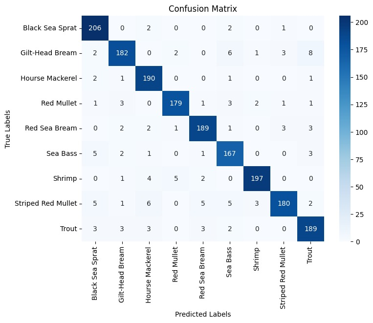

# Fish-Classification
[Kaggle Notebook](https://www.kaggle.com/code/burhankorkmaz/fish-classification-with-ann-97-acc)
### Projenin Amacı
Bu projede, çeşitli balık türlerini sınıflandırmak amacıyla bir yapay sinir ağı modeli oluşturulmuştur. Model, balık fotoğraflarını kullanarak doğru sınıflandırma yapmayı hedeflemektedir.

### Veri Seti
Veri setinde 9 farklı balık türüne ait fotoğraflar bulunmaktadır. Bu 9 balık türü şöyledir:
- Yaldızlı Çipura
- Kızıl Çipura
- Levrek
- Barbunya
- İstarvit
- Karadeniz Çaça
- Çizgili Barbunya
- Alabalık
- Karides
Bu balık türlerinin Fotoğraflarnı içermetkedir.

### Model

Modeli oluşturmaya başlarken ilk başlarda basit yapay sinir ağları ile başladım dropout vb. katmanlar kullanmadan. Optimizer olarak Adam optimizerı kullandım. İlk sonuçlarda modelin aşırı öğrenme(overfitting) yaptığını fark ettim. Ondan sonra modele dropout ve batch normalization katmanları ekledim. Aşırı öğrenme sorunu hala devam ediyordu. Her dense katmanına l2 regularizasyonu ekledim aşırı öğrenme için ama hala aşırı öğrenme yapıyordu. Farklı optimizerlar kullanmaya karar verdim SGD, Adadelta, Adagrad optimizerları ile aynı modelde eğitimler yaptım bu optimizerlar ile model aşırı öğrenme yapmıyordu.

#### Model Mimarisi
Modelde kullanılan katmanlar.

  

### Performans Sonuçları
Aşağıdaki tabloda modelin farklı optimizerla aldığı sonuçlara yer verilmiştir.

| Optimizer | eğitim_doğ | eğitim_kayıp | test_doğ | test_kayıp | test_keskinlik | test_duyarlılık | test_f1score |
| --------- | ---------- | ------------ | -------- | ---------- | -------------- | --------------- | ------------ | 
| Adam      | 0.4548     | 1.9911       | 0.4727   | 1.8795     | 0.7252         | 0.1803          | 0.4480       | 
| SGD       | 0.9917     | 2.3564       | 0.9565   | 2.5047     | 0.9592         | 0.9565          | 0.9557       | 
| Adagrad   | 0.9995     | 1.2954       | 0.9662   | 1.3884     | 0.9676         | 0.9644          | 0.9656       | 
| Adadelta  | 0.9949     | 2.6021       | 0.9220   | 2.7766     | 0.9412         | 0.9022          | 0.9186       | 

ANN modeline ek olarak önceden eğitilmiş modellerden olan InceptionV3 modelini kullanarak yeni bir model eğittim. O model ile %99 test doğruluğuna ulaştım.

Test Verisinin Karmaşıklık Matrisleri

**Adam** Optimizer ile alnınan test sonuçları.

  

**SGD** Optimizer ile alınan test sonuçları.

  

**Adagrad** Optimizer ile alınan test sonuçları.

  

**Adadelta** Optimizer ile alınan test sonuçları.

  

**InceptionV3** hazır modeli ile alınan test sonuçları.

  

Test sonuçları ile birlikte en başarılı modelin InceptionV3 modeli olduğu görülmektedir. ANN'ler arasında ise Adagrad optimizer ile eğitilen modelin en başarılı olduğu görülmektedir.

### Test Verisi ile tahminleme

En başarılı **ANN** modelinin yaptığı tahminler

  

InceptionV3 modelinin yaptığı tahminler:

  

